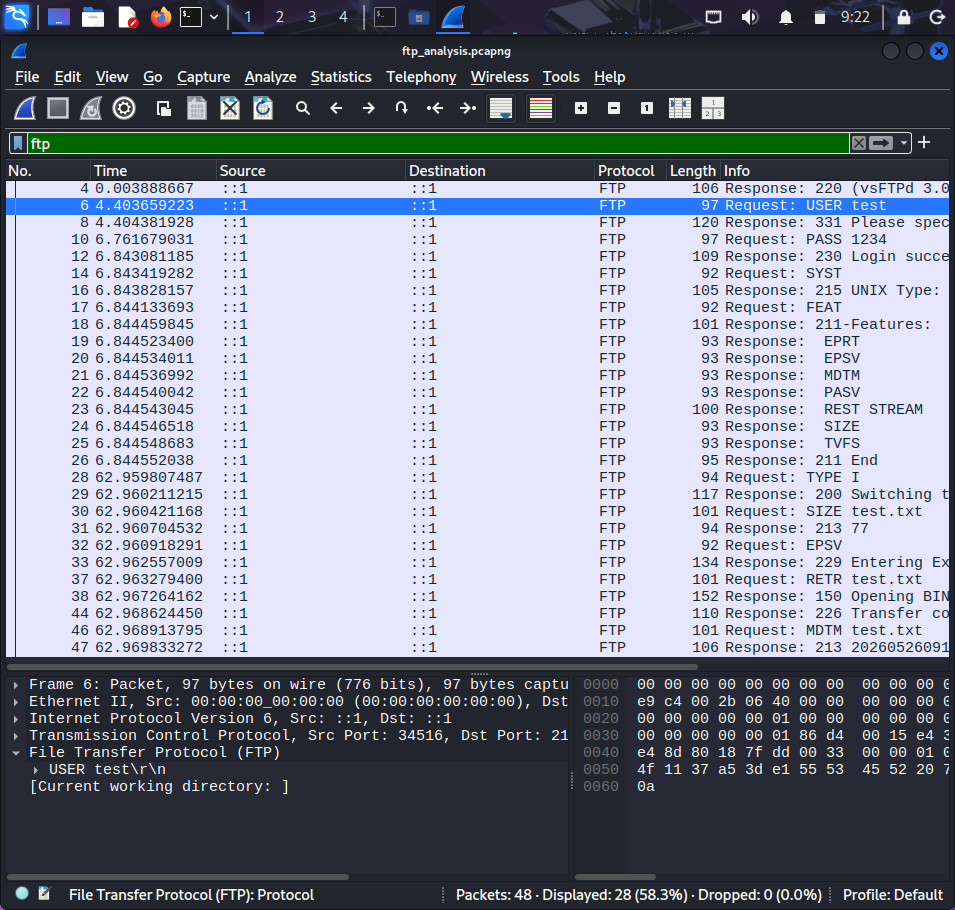
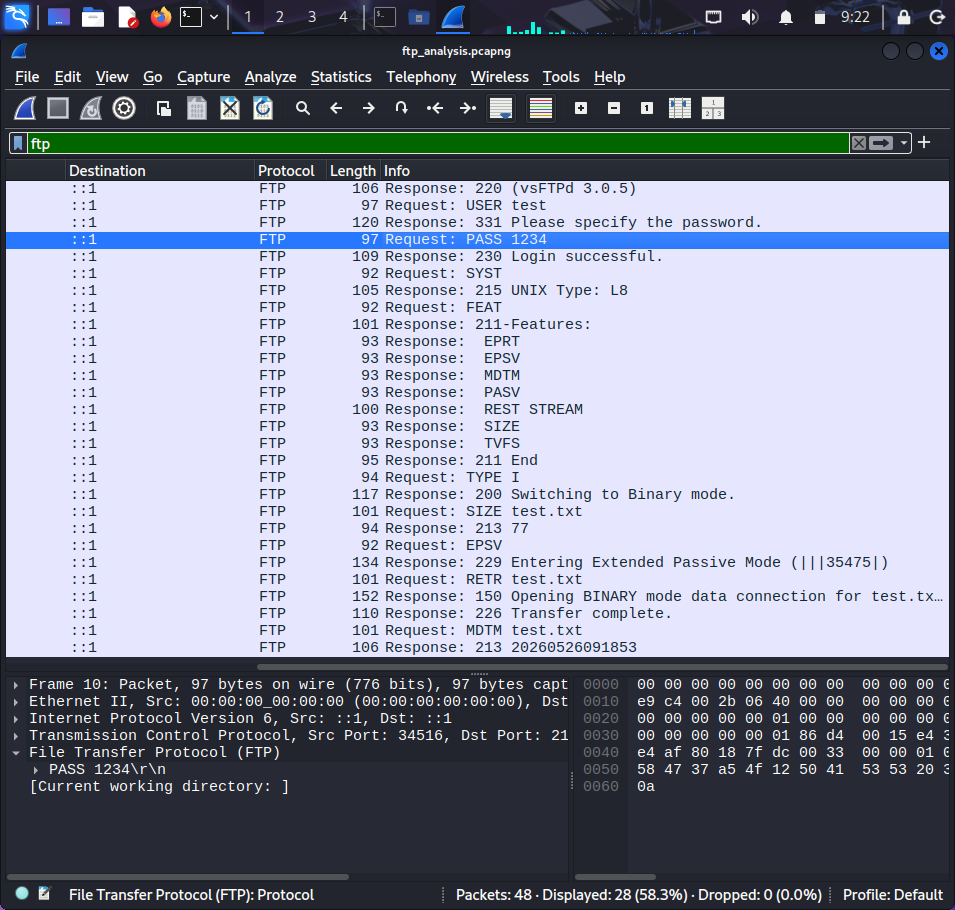
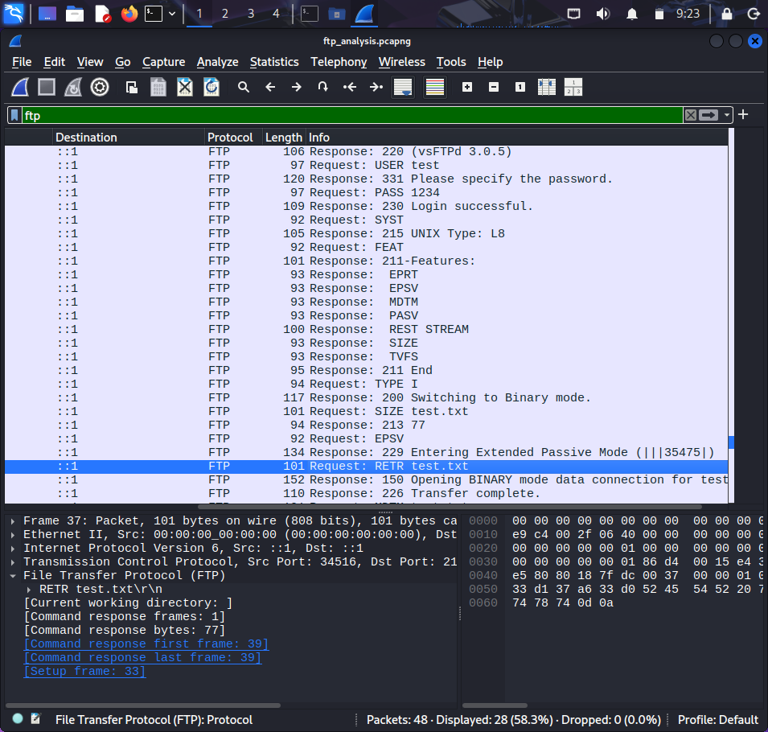
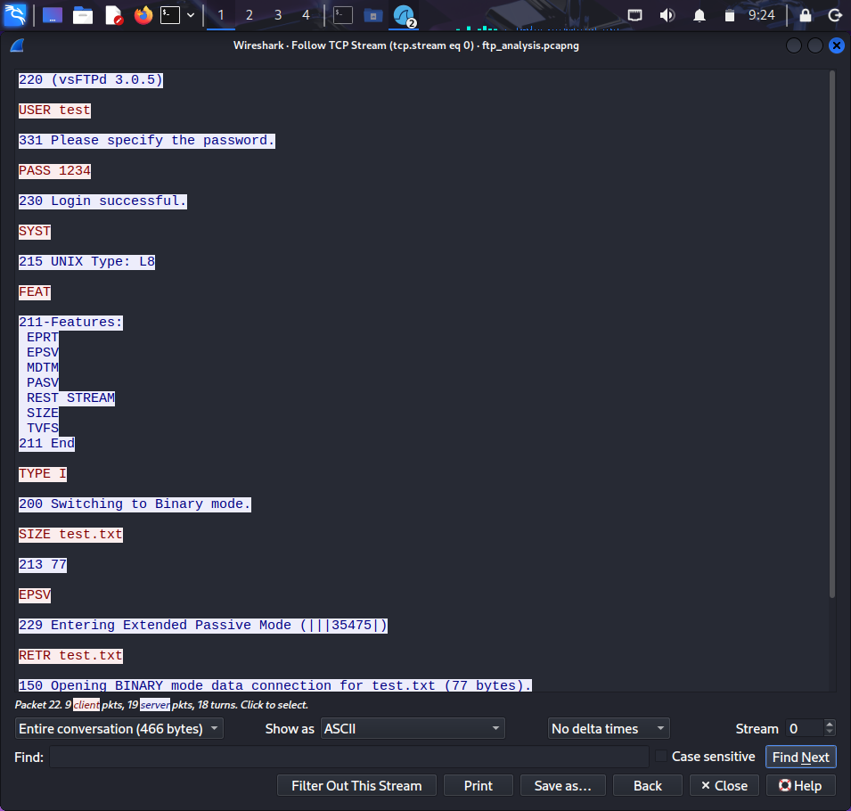

# FTP Traffic Analysis using Wireshark

## Objective
The objective of this project is to analyze FTP authentication and file transfer traffic using Wireshark.

## Tools Used
- Wireshark
- vsftpd (FTP Server)

## Methodology

### 1. Packet Capture
Network traffic was captured during FTP login and file transfer operations.

### 2. FTP Communication
An FTP connection was established between client and server.
Authentication and file transfer activities were performed.

## Analysis Performed

### FTP Authentication Analysis
FTP packets were analyzed to identify authentication requests.

Observed:
- USER command
- PASS command

Credentials were visible in plaintext.

---

### File Transfer Analysis
FTP commands related to file upload/download were analyzed.

Observed:
- STOR (upload)
- RETR (download)

---

### TCP Stream Analysis
TCP Stream analysis was used to observe communication between FTP client and server.

### Endpoint Statistics
Endpoint statistics were analyzed to identify communication endpoints and packet counts.

## Screenshots

### FTP Login

### FTP Credentials

### File Transfer

### TCP Stream

### Endpoint Statistics

## Security Insights
- FTP transmits credentials in plaintext  
- File transfer activity can be intercepted  
- Lack of encryption creates security risks  

## Conclusion
This project demonstrates how Wireshark can analyze FTP communication and identify security weaknesses in unencrypted protocols.

## Learning Outcomes
- FTP protocol analysis  
- Authentication traffic inspection  
- File transfer monitoring  
- TCP Stream analysis  
- Network security awareness
